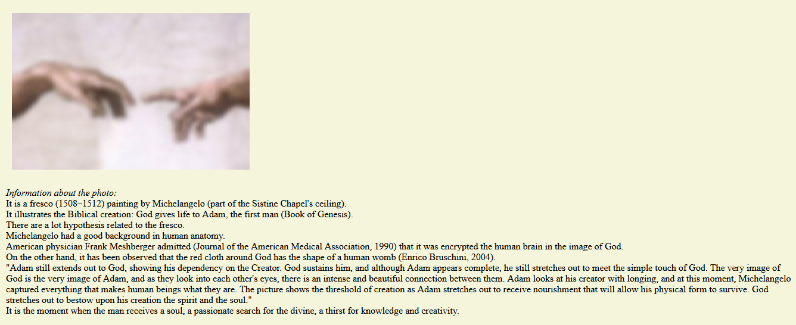
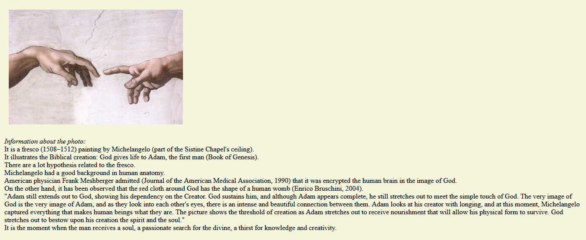

## Events with photo

#### Description
The project was built for implementing JavaScript events with a photo.
  When open .html file in a browser the photo is blur:

  The photo changes to normal when hover the photo with the mouse (event onmouseover):

  The photo becomes blur again when unhover the photo with the mouse (event onmouseout):

#### Instruments
The project based on 
* JavaScript:
> methods getElementById;
> functions;
> events: onload, onmouseover, onmouseout;
> anonymous functions;
* HTML;
* CSS.

Done with 💗